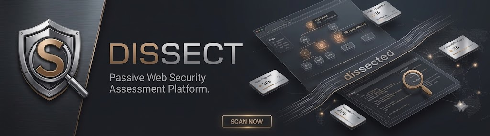
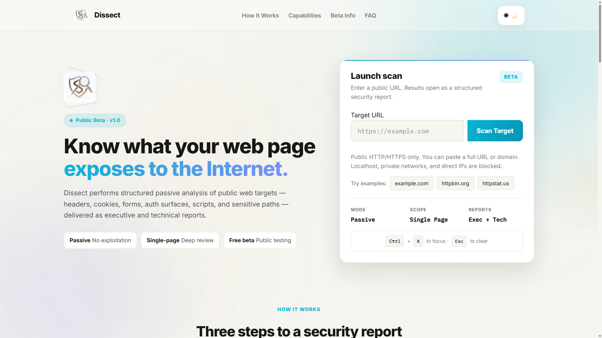
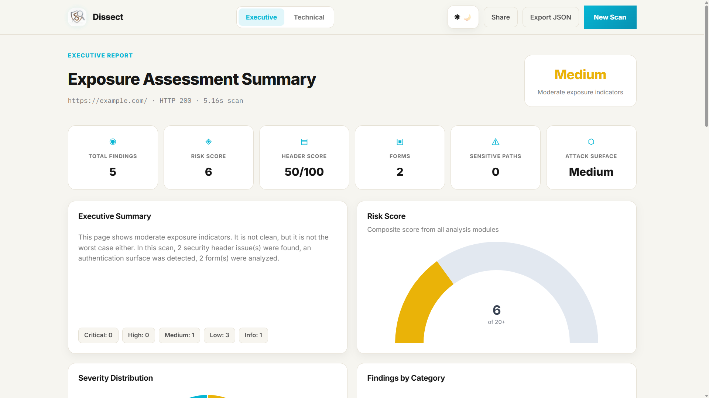
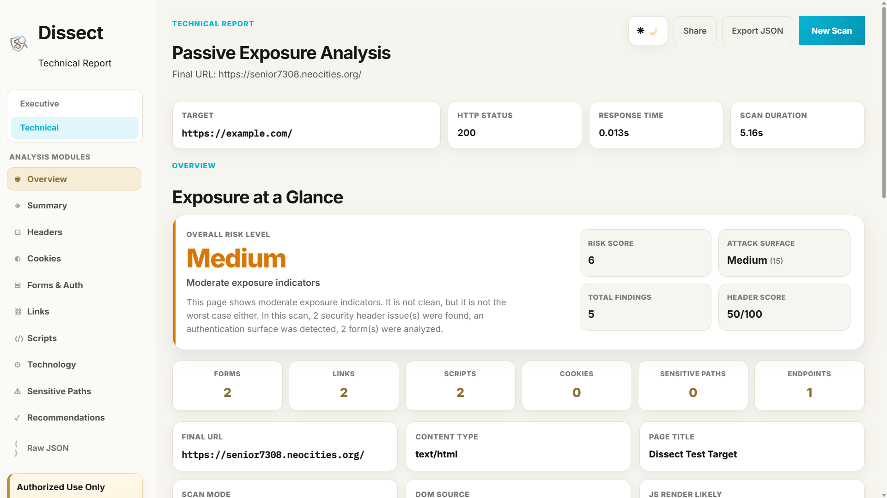

# 🛡️ Dissect

<p align="center">
  
</p>

<p align="center">
<b>Passive Web Security Scanner for Modern Websites</b><br>
Fast • Non-Intrusive • Professional Reporting
</p>

<p align="center">


</p>

---

# 🌐 Live Demo

**https://dissect.up.railway.app/**

---

# 📖 Overview

Dissect is a **passive web security scanner** designed to help developers, cybersecurity students, and security professionals identify common web security misconfigurations without performing intrusive testing.

The scanner analyzes publicly accessible web resources—including HTTP responses, browser-rendered content, cookies, authentication surfaces, forms, and client-side resources—to provide meaningful security insights through structured reports.

Unlike active vulnerability scanners, Dissect **does not attempt exploitation or modify server state**, making it suitable for defensive security reviews and authorized assessments.

---

# ✨ Core Capabilities

* ✅ Passive Security Assessment
* ✅ HTTP Security Header Analysis
* ✅ Cookie Security Review
* ✅ Authentication Surface Detection
* ✅ HTML Form Discovery
* ✅ JavaScript-Rendered DOM Analysis
* ✅ Technology Fingerprinting
* ✅ Interesting Endpoint Discovery
* ✅ Executive & Technical Reports
* ✅ Responsive Web Interface

---

# 🔍 Scanner Modules

## HTTP & Transport Security

* Security Header Analysis
* Response Header Inspection
* Redirect Chain Analysis
* Transport Security Review

---

## Cookie Security

* Secure Attribute Validation
* HttpOnly Detection
* SameSite Analysis
* Session Cookie Review
* Cookie Risk Assessment

---

## Authentication Surface Analysis

* Login Page Detection
* Username Field Discovery
* Password Field Detection
* Password Reset Discovery
* Registration Form Detection
* Authentication Workflow Analysis

---

## HTML Form Analysis

* Login Forms
* Registration Forms
* Contact Forms
* Search Forms
* Password Reset Forms
* Hidden Input Detection
* Suspicious Parameter Identification

---

## Browser Rendering

Using Playwright, Dissect analyzes JavaScript-rendered pages to inspect content that is unavailable through traditional HTTP requests.

Capabilities include:

* JavaScript-rendered DOM Analysis
* Dynamic Authentication Detection
* SPA Login Discovery
* Client-side Resource Inspection

---

## Risk Assessment

* Missing Security Header Detection
* Security Severity Classification
* Risk Explanation
* Actionable Security Recommendations

---

## Reporting

Dissect generates two complementary reports:

### Executive Report

Designed for managers, developers, and quick assessments.

Includes:

* Overall Security Score
* Executive Summary
* Key Findings
* Risk Breakdown
* Recommendations

### Technical Report

Designed for developers and security practitioners.

Includes:

* Complete Scan Results
* Detailed Technical Findings
* Evidence
* Risk Classification
* Security Recommendations

---

# 📸 Screenshots

## Home



---

## Executive Report



---

## Technical Report



---

# 🏗️ High-Level Architecture

```text
                    User
                      │
                      ▼
             Flask Web Application
                      │
                      ▼
             Passive Scanning Engine
        ┌─────────────┼─────────────┐
        │             │             │
        ▼             ▼             ▼
   HTTP Analysis  Browser Render  HTML Parsing
    (Requests)    (Playwright)   (BeautifulSoup)
        │             │             │
        └─────────────┼─────────────┘
                      ▼
               Analysis Engine
                      │
                      ▼
               Risk Assessment
                      │
        ┌─────────────┴─────────────┐
        ▼                           ▼
 Executive Report           Technical Report
```

---

# 🛠️ Technology Stack

| Category          | Technology              |
| ----------------- | ----------------------- |
| Backend           | Python, Flask           |
| Frontend          | HTML, CSS, JavaScript   |
| Browser Rendering | Playwright              |
| HTTP Analysis     | Requests                |
| HTML Parsing      | BeautifulSoup           |
| XML Parsing       | lxml                    |
| Deployment        | Docker, Railway, Render |

---

# 🎯 Design Philosophy

Dissect follows a **passive-first** approach to web security assessment.

The scanner intentionally avoids:

* Payload Injection
* Exploitation
* Brute Force Attacks
* Server Modification
* Intrusive Testing

Instead, it focuses on identifying security weaknesses that are observable through publicly accessible resources and browser-rendered content.

---

# 🚀 Roadmap

## Version 1.0

* ✅ Passive Security Scanner
* ✅ HTTP Security Analysis
* ✅ Cookie Analysis
* ✅ Authentication Surface Detection
* ✅ HTML Form Analysis
* ✅ Browser Rendering
* ✅ Executive Report
* ✅ Technical Report
* ✅ Responsive Interface

---

## Future Enhancements

* SSL/TLS Certificate Analysis
* DNS Information
* WHOIS Information
* robots.txt Analysis
* sitemap.xml Analysis
* Multi-page Crawling
* Historical Scan Comparison
* PDF Report Export
* User Dashboard
* Scheduled Scans

---

# ⚠️ Responsible Use

Dissect is intended for educational purposes and authorized security assessments only.

Only scan systems that you own or have explicit permission to assess.

Users are responsible for ensuring compliance with applicable laws and regulations.

---

# 📚 Documentation

This repository serves as the official documentation and project information page for Dissect, including its architecture, capabilities, development roadmap, and updates.

---

# 📄 License

This project is licensed under the **MIT License**.

---

# 👨‍💻 Author

**Ashish Agrawal**

Cybersecurity Student • Security Enthusiast • Future Cybersecurity Engineer

---

<p align="center">
If you found this project interesting, consider ⭐ starring the repository.
</p>
