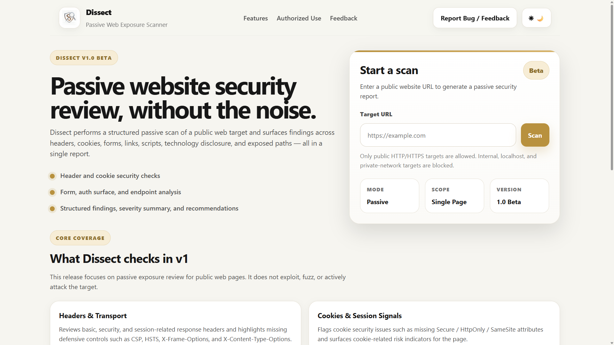
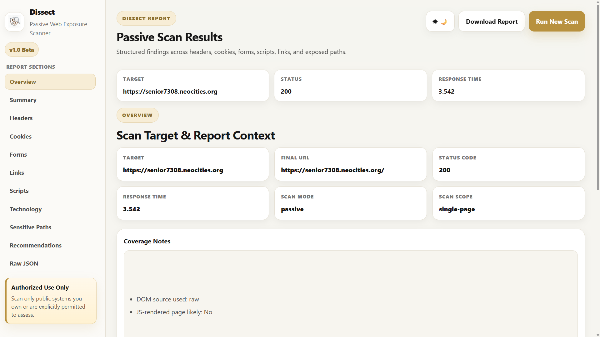
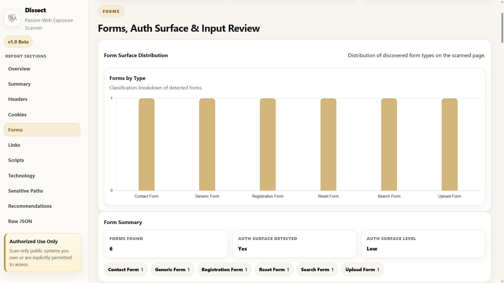
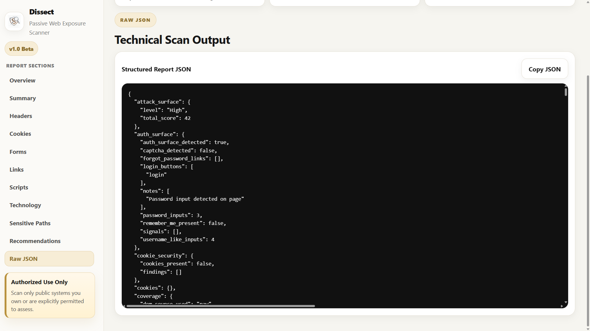

# Dissect — Web Exposure & Surface Review Scanner

Dissect is a Python + Flask web security scanner that analyzes a target website for visible exposure indicators such as missing security headers, insecure cookie configurations, exposed forms, link inventory, client-side script references, basic technology indicators, and limited sensitive-path findings.

This repository is the **public showcase** for the project. It contains the project overview, screenshots, architecture summary, sample output, and feature documentation. The full production implementation and internal scanner logic are maintained separately in a private repository.

---

## Why I Built Dissect

I built Dissect as a practical cybersecurity portfolio project to move beyond theory and create a usable web application for structured web exposure review.

The project was designed to combine:

- **backend security analysis logic**
- **structured findings generation**
- **a usable reporting interface**
- **frontend presentation of scan results**
- **a clean, deployable Flask application**

The goal was not to build a full penetration testing platform, but to create a focused scanner that surfaces useful web exposure indicators in a way that is readable, organized, and portfolio-worthy.

---

## Core Capabilities

Dissect v1 currently supports:

- **HTTP security header analysis**
  - identifies missing or weak response security headers
- **Cookie security review**
  - highlights potentially unsafe cookie attributes and exposure concerns
- **Form discovery and classification**
  - inspects visible forms and classifies common patterns such as login, registration, reset, or contact flows
- **Link extraction and inventory**
  - collects internal/external links, schemes, paths, and visible text references
- **Client-side script reference collection**
  - records script sources and related observations from page content
- **Basic technology fingerprinting**
  - surfaces visible technology indicators from headers and page content
- **Sensitive path checks**
  - performs limited exposure-oriented path checks for commonly interesting locations
- **Structured reporting UI**
  - overview, findings sections, raw JSON, and tabbed report navigation
- **Light / dark theme support**
- **Downloadable report output**

---

## Feature Areas

Dissect organizes scan results into separate report sections so findings are easier to review:

- **Overview**
  - target context, scan metadata, coverage notes, and summary charts
- **Summary**
  - condensed finding counts and high-level risk distribution
- **Headers**
  - security header presence / absence observations
- **Cookies**
  - cookie flags and session-related concerns
- **Forms**
  - discovered forms, form classification, hidden field visibility, and related findings
- **Links**
  - extracted links, paths, schemes, and visible anchor text
- **Scripts**
  - client-side script references and script-related notes
- **Technology**
  - visible technology indicators inferred from the target response or markup
- **Sensitive Paths**
  - lightweight path probing observations
- **Recommendations**
  - grouped remediation suggestions based on findings
- **Raw JSON**
  - structured machine-readable scan output for debugging and review

---

## Screenshots

> Replace these paths with your final screenshots after you add them to the repository.

### Landing Page


### Results Overview


### Forms Analysis


### Raw JSON Report


---

## Architecture Overview

Dissect follows a staged scan pipeline:

### 1) Input & Target Normalization
The user submits a target URL through the web interface. The application normalizes and validates the input before starting a scan workflow.

### 2) Collection
The scanner retrieves the target response and gathers data such as:

- response headers
- cookies
- forms
- links
- script references
- selected metadata from the page source

### 3) Analysis
Collected data is passed through section-specific analysis logic that converts raw observations into structured findings and summary counts.

### 4) Reporting
The application renders the results into:

- an overview section
- section-wise findings tabs
- charts and summary cards
- raw JSON output
- downloadable report data

---

## High-Level Scan Flow

```text
User Input
   ↓
Target Validation & Normalization
   ↓
HTTP Request / Page Retrieval
   ↓
Collection Layer
   ├─ Headers
   ├─ Cookies
   ├─ Forms
   ├─ Links
   ├─ Scripts
   └─ Page Metadata
   ↓
Analysis Layer
   ├─ Findings Extraction
   ├─ Section Summaries
   ├─ Severity Grouping
   └─ Recommendations
   ↓
Results Rendering
   ├─ Overview
   ├─ Section Tabs
   ├─ Charts
   └─ Raw JSON / Download
